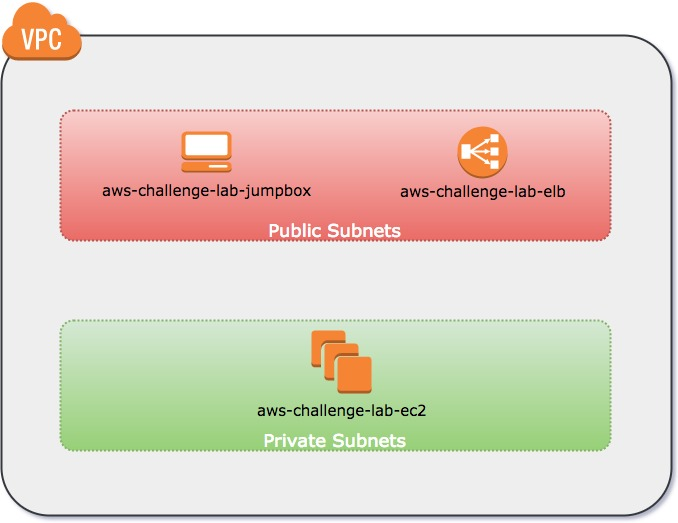

# AWS Challenge Lab

## Description
This is a typical AWS VPC running in **Oregon (us-west-2)** region with both public subnets and private subnets. As shown below, a jumpbox and a Elastic Load Balancer are in public subnet. One or more EC2 instances are in private subnets.

## Tasks
Use ApacheBench to run a load test (8000 requests, 50 concurrency) against the web site (refer ELB DNS), and log the memory usage on the aws-challenge-lab-ec2 EC2 instance every 5 seconds.

## Hints
For some reasons, the web site currently is down. You need to fix it before you can run the load test. The AWS credential and SSH private key will be provided before you start. 

Just be aware of that your account has very limited permissions, but it should be enough for you to fix the problem. Feel free to use Google and also you can ask interviewer for more hints if you are stuck in somewhere for too long. Good luck!